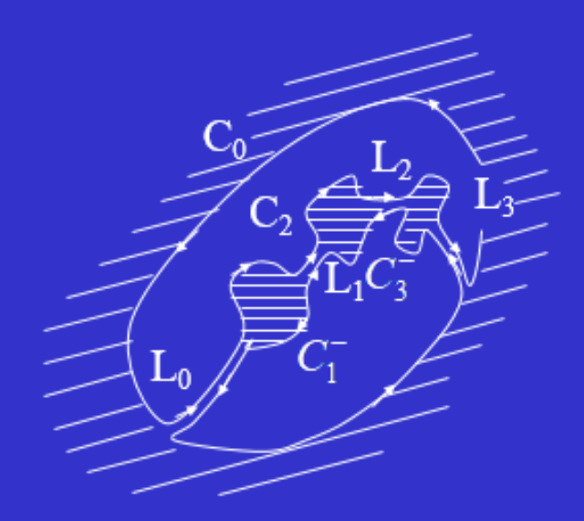
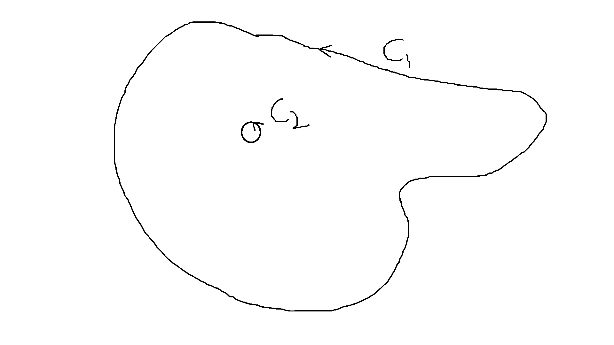
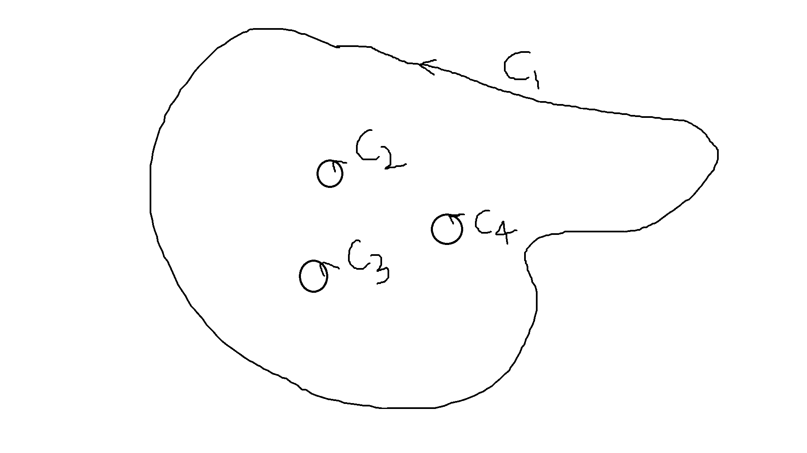

数学物理方法第三章

路毅 曲阜师范大学

# 1. 复变积分

## 1.1 定义

复变积分：$C$为起点$z_0$、终点$z_n$之间的有向曲线，在曲线上依次取节点 $z_0, z_1, \cdots, z_{n-1}, z_n$，沿正向顺序
$$
\Delta z_k = z_k - z_{k-1},
$$
定义$C$上的复变积分
$$
\int_c f(z) dz = \lim_{\Delta z_1, \Delta z_2, \cdots, \Delta z_n \rightarrow 0} \sum^n_{k=1} f(\zeta_k) \Delta z_k,
$$
其中 $\zeta_k$ 为 $z_{k-1}$ 到 $z_k$ 的弧段上任意一点。

如果 $C$ 是逐段光滑的闭曲线，则称作是 **围线**，定义其正方向，使得：沿围线正方向时，围线“内部”始终在左侧。

## 1.2 例题1

计算积分$\int_C Re（z）dz$，其中积分路径 $C$ 为：

* $C$为联结$O$点到$1+i$点的直线段。
* $C$为联结$O$点到$1$点再到$1+i$点的折线。

解：（1）记复平面上 $1+i$ 为 A 点，则在线段 $OA$ 上，有
$$
z = x + i x ~~~ \Rightarrow ~~~dz = (1+i)dx
$$
被积函数为 $f(z) = Re(z) = x$，所以有
$$
\int_C Re(z) dz  = \int_{OA} Re(z) dz = \int^1_0 x (1+i)dx = \frac{1+i}{2}.
$$
(2) 即复平面上 $B$ 点为 $(1,0)$，则在线段 $OB$ 上，有
$$
z = x ~~~\Rightarrow~~~ dz = dx ~~~\Rightarrow~~~\int_{OB} Re(z) dz = \int^1_0 x dx = \frac{1}{2};
$$
在线段 $BA$ 上，有
$$
z = 1 + iy ~~~\Rightarrow~~~ dz = idy ~~~\Rightarrow~~~ \int_{BA} Re(z) dz = \int^1_0 1 (idy) = i;
$$
所以整个复变积分为 $\int_C Re(z) dz = \frac{1}{2} + i$。

## 1.3 例题2

试证：
$$
\oint_C \frac{ dz }{ (z-a)^n } = \left\{
\begin{aligned}
& 2\pi i, & n=1 \\
& 0, & n\neq 1, n\in Z
\end{aligned}
\right.
$$

其中 $C$ 表示以 $a$ 为中心，$\rho$ 为半径的圆周。

证明：

因为 $C$ 表示以 $a$ 为中心，$\rho$ 为半径的圆周，所以在 $C$ 上的复数可以表示为
$$
z = a+\rho e^{it}, ~~~ t \in [0,2\pi].
$$
取微分，则有
$$
dz = d(a+\rho e^{it}) = i\rho e^{it} dt,
$$
$n=1$ 时，有
$$
\oint_C \frac{dz}{z-a} = \int^{2\pi}_0 \frac{ i\rho e^{it} dt}{\rho e^{it}} = \int^{2\pi}_0 idt = 2\pi i,
$$
$n\neq 1$，且 $n\in Z$ 时，
$$
\oint_C \frac{dz}{(z-a)^n} = \int^{2\pi}_0 \frac{ i\rho e^{it} dt}{(\rho e^{it})^n} = i \rho^{1-n} \int^{2\pi}_0 e^{i(1-n)t}dt = 0,
$$

## 1.4 复变积分的性质

### 1.4.1 证明： $\int_C dz = z_1 - z_0$，其中 $z_0, z_1$为曲线$C$的起点、末点。

### 1.4.2 证明：$|\int_C f(z) dz | \leq \int_C |f(z)| |dz|$

### 1.4.3 证明： $|\int_C f(z) dz | \leq Ml$，其中 $M$ 是 $|f(z)|$ 在 $C$ 上的上界，$l$ 为 $C$ 的长度。

# 2. 柯西积分定理

## 2.1 证明

若$f(z)$在单连通区域$D$内解析，$C$是$D$内的任一围线，则
$$
\oint_C f(z) dz = 0.
$$
若$f^\prime(z)$在$D$内连续，则上述定理很好证明。由于
$$
f(z) = u(x,y) + iv(x,y),
$$
所以有
$$
\oint_C f(z) dz = \oint_C udx - vdy + i\oint_C vdx + udy,
$$
根据格林公式：
$$
\oint_C P(x,y)dx + Q(x,y)dy = \oiint_S (\frac{\partial Q}{\partial x} - \frac{\partial P}{\partial y}) dxdy,
$$

其中$C$为曲线，$S$ 为 $C$ 包围的曲面。
$$
\oint_C f(z) dz &=& \oint_C udx - vdy + i\oint_C vdx + udy, \\
&=& \oint_S (- v_x - u_y)ds + i \oint_S (u_x - v_y) ds ~~=~~ 0.
$$

## 2.2 不定积分，原函数
如果$f(z)$的单连通区域$D$内解析，则
$$
F(z) = \int^z_{z_0} f(\zeta) d\zeta
$$
只与起点$z_0$和终点$z$有关，与路径无关（试着自己证明这一点）。所以选定$z_0$以后，$F(z)$ 就是关于 $z$ 的函数。其导数为
$$
F^\prime(z) = f(z),
$$
所以$F(z)$称为$f(z)$的不定积分，或原函数。
例3
$$
\int^b_a z \cos z^2 dz = \frac{1}{2}(\sin b^2 - \sin a^2),
$$
例4
$$
\int^z_1 \frac{d \zeta}{ \zeta} = \ln z - \ln 1 = \ln z.
$$

## 2.3 柯西积分定理：推广到复围线

如图做辅助线，构造回路，将复连通区域变为 2 个单连通区域 $C_{up}, C_{down}$。根据简单围线上的柯西定理有
$$
\oint_{C_{up}} f(z) dz = 0, ~~~ \oint_{C_{down}} f(z) dz = 0. ~~~\Rightarrow~~~ \oint_{C_{up}} f(z) dz + \oint_{C_{down}} f(z) dz = 0.
$$
在极限情况下，辅助线抵消，得到
$$
C_{up} + C_{down} = C_0 + C_1 + C_2 + C_3,
$$
所以有
$$
\oint_{C_0} f(z) dz + \oint_{C_1} f(z) dz + \oint_{C_2} f(z)dz + \oint_{C_3} f(z) dz ~~~=~~~\oint_{C_{up}} f(z) dz + \oint_{C_{down}} f(z) dz ~~~=~~~  0.
$$
因此，***解析函数在复围线上的积分为零***。即柯西积分定理在复围线上成立。
### 2.4 柯西积分定理的推论1

若$f(z)$在$C_1,C_2$之间的区域解析，根据复围线上的柯西积分定理，有
$$
\oint_{C_1} f(z) dz + \oint_{C^-_2} f(z) dz = 0,
$$
其中$C^-_2$与图中$C_2$的方向相反。由于$\oint_{C^-_2} f(z) dz = - \oint_{C_2} f(z) dz$，所以有
$$
\oint_{C_1}f(z) dz = \oint_{C_2}f(z)dz.
$$

## 2.5 柯西积分定理的推论2

若$f(z)$在$C_1$之内,$C_2,C_3,C_4$之外的区域解析，根据复围线上的柯西积分定理，有
$$
\oint_{C_1} f(z) dz + \oint_{C^-_2} f(z) dz + \oint_{C^-_3} f(z) dz + \oint_{C^-_4} f(z) dz = 0,
$$
所以有
$$
\oint_{C_1}f(z) dz = \oint_{C_2}f(z)dz + \oint_{C_3}f(z) dz + \oint_{C_4} f(z) dz.
$$

## 2.6 例题

例5：设$a$是围线$C$内部一点，证明
$$
\oint_C \frac{dz}{(z-a)^n} = \left\{
\begin{aligned}
2 \pi i, n=1 \\
0, n \neq 1, n\in Z
\end{aligned}
\right.
$$
根据前面给出的推论1，
$$
\oint_C \frac{dz}{(z-a)^n} = \oint_{\gamma_\rho} \frac{dz}{(z-a)^n},
$$
其中，$\gamma_\rho$表示以$a$为圆心，以很小的$\rho$为半径（$\gamma_\rho$全在$C$内部）的圆。因为$\frac{1}{(z-a)^n}$在$C$与$\gamma_\rho$之间处处解析，所以根据推论1有上面的式子。

可以设$\gamma_\rho$上任意点为$z = a + \rho e^{i\theta}$，则有$dz = i \rho e^{i\theta} d \theta$，所以
$$
\oint_C \frac{dz}{(z-a)^n} = \oint_{\gamma_\rho} \frac{dz}{(z-a)^n} = \int^{2\pi}_0 \frac{i \rho e^{i\theta} d \theta}{\rho^n e^{in \theta}}
= \left\{
\begin{aligned}
2 \pi i, n=1 \\
0, n \neq 1, n\in Z
\end{aligned}
\right.
$$
例6：计算$\oint_C \frac{dz}{z^2 -1}$，其中$C$为圆周$|z|=2$。

因为
$$
\frac{1}{z^2 -1} = \frac{1}{2}( \frac{1}{z-1} - \frac{1}{z+1} ),
$$
所以有
$$
\oint_C \frac{dz}{z^2 -1} &=& \frac{1}{2}\oint_C \frac{dz}{z-1} - \frac{1}{2} \oint_C \frac{dz}{z+1}
\nonumber\\
&=& \frac{1}{2}(2\pi i) - \frac{1}{2}(2\pi i) ~~~=~~~ 0.
$$

# 3. 柯西积分公式
## 3.1 柯西积分公式

区域$D$边界是$C$，$f(z)$在$D$内解析，在$\bar{D}=D+C$上连续，则有
$$
f(z) = \frac{1}{2\pi i} \oint_C \frac{f(\zeta)}{\zeta - z} d\zeta.
$$
证明：取$z$为圆心，半径为$\rho$（很小）的回路$\gamma_\rho$，根据复围线的柯西积分定理，
$$
\oint_C \frac{f(\zeta)}{\zeta - z} d \zeta
= \oint_{\gamma_\rho} \frac{f(\zeta)}{\zeta - z} d \zeta
= \lim\limits_{\rho \rightarrow 0} \oint_{\gamma_\rho} \frac{f(\zeta)}{\zeta - z} d \zeta = 2\pi i f(z),
$$
所以有
$$
f(z) = \frac{1}{2\pi i} \oint_C \frac{f(\zeta)}{\zeta - z} d\zeta.
$$
这说明：解析函数的值可以用它在边界上的值表示！可以考虑静电场的唯一性定理。
## 3.2 例题
回路$C$为圆周$|z|=2$，计算$\oint_C \frac{z}{(9-z^2)(z+i)} dz$。
$$
\oint_C \frac{z}{(9-z^2)(z+i)} dz
= \oint_C \frac{z/(9-z^2)}{z-(-i)} dz,
$$
因为$z/(9-z^2)$在$C$及其内部都解析，所以可以使用柯西积分公式:
$$
f(z) = \frac{1}{2\pi i} \oint_C \frac{f(\zeta)}{\zeta - z} d\zeta.
$$
套用这个公式，计算$z/(9-z^2)$在$z=-i$时的取值，得到
$$
\oint_C \frac{z}{(9-z^2)(z+i)} dz
= \oint_C \frac{z/(9-z^2)}{z-(-i)} dz ~~~=~~~ 2\pi i \frac{-i}{9-(-i)^2} = \frac{\pi}{5}.
$$

## 3.3 解析函数的无限次可微性
$$
f(z) = \frac{1}{2\pi i} \oint_C \frac{f(\zeta)}{\zeta - z} d \zeta, z \in D，
$$

易得
$$
f^{(n)}(z) = \frac{n!}{2\pi i} \oint_C \frac{f(\zeta)}{(\zeta - z)^{n+1}} d\zeta, z \in D, n=1,2,\cdots
$$
也可以写作
$$
\oint_C \frac{f(z)}{(z-a)^n} dz
= \frac{2\pi i}{(n-1)!} f^{(n-1)} (a), a\in D, n=1,2,\cdots
$$
所以，只要$f(z)$在围线$C$上连续，在$C$内解析，则$f(z)$在$C$内任一点都有任意阶导数，任意阶导数值都可由上式计算，即用$C$上的函数值表达。

## 3.4 例子
计算积分：
$$
I = \oint_C \frac{e^z}{(z^2+1)^2} dz,
$$
其中$C$是由$|z|=a,a>1$确定的区域。

解：构造复围线，由$C，C_1,C_2$构成，其中，$C_1$为绕$z=i$点的小圆环，$C_2$为绕$z=-i$点的小圆环。根据复围线的柯西积分定理，
$$
I &=& \oint_C \frac{e^z}{(z^2+1)^2} dz = \oint_{C_1} \frac{e^z}{(z^2+1)^2} dz + \oint_{C_2} \frac{e^z}{(z^2+1)^2} dz, \nonumber\\
&=& \oint_{C_1} \frac{e^z/(z+i)^2}{(z-i)^2} dz + \oint_{C_2} \frac{e^z/(z-i)^2}{(z+i)^2} dz, \nonumber\\
&=& 2 \pi i [e^z/(z+i)^2]'|_{z=i} + 2\pi i[e^z/(z-i)^2]'|_{z=-i},
$$
最后一个等号使用了(32)式。所以，经过计算得到
$$
I = \frac{\pi}{2}(1-i)e^i + \frac{\pi }{2}(-1-i)e^{-i}
= i\pi \sqrt{2}\sin(1-\pi/4).
$$

## 4 作业

课堂选讲：1, 4, 5, 7, 8, 15

课后作业：2, 9, 11, 12, 14